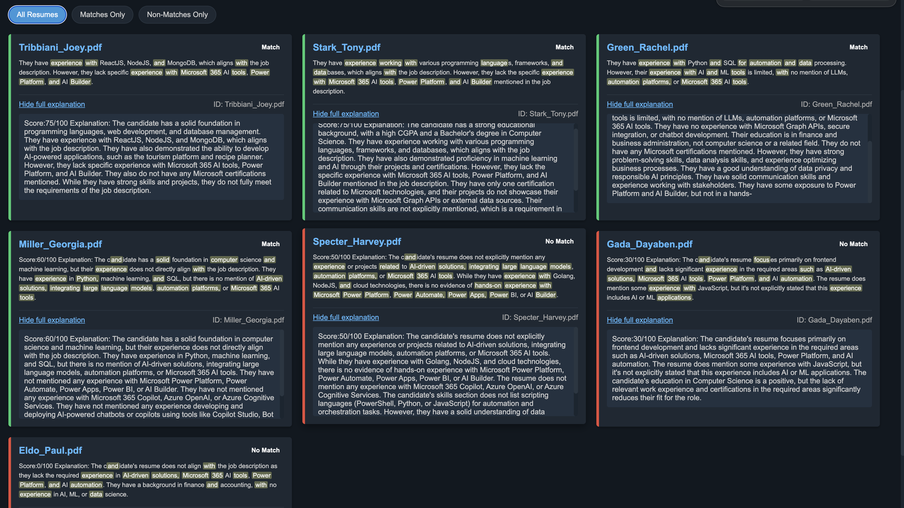

# Oracle Recruiter AI Chrome Extension

A Chrome Extension designed to enhance the Oracle Recruiter experience with AI-powered features for candidate evaluation, resume extraction, and LinkedIn search integration.

## UI demonstration 

### Popup Interface

### Search Results

## Overview

This Chrome Extension integrates with Oracle's recruitment platform to provide advanced AI assistance during the hiring process. The extension helps recruiters extract candidate information, search through resumes, and match candidates with job requirements using modern AI techniques.

## Features

### Resume Extraction
- Automatically finds and extracts resume PDFs from Oracle Cloud
- Handles resume links with both "preview=true" and "preview=false" URLs
- Extracts candidate names from page content to create organized filenames
- Identifies resume links from various page elements (links, iframes)

### Job Requirement Analysis
- Extracts job requirements from posting descriptions
- Uses regex pattern matching to find the "What you'll bring" section
- Automatically navigates through the application to gather relevant data

### Candidate Evaluation
- Compares candidate profiles with job requirements
- Provides match scores and detailed analysis of candidate fit
- Supports batch processing of multiple candidates

### LinkedIn Integration
- Searches LinkedIn for candidates based on job requirements
- Displays LinkedIn profiles directly in the extension interface
- Continues working even if the extension popup is closed

### Resume Search
- Search through indexed resumes to find qualified candidates
- Full-text search capabilities for finding specific skills or experience
- Results display with highlighted matching sections

## Installation

1. Download or clone this repository
2. Open Chrome and navigate to `chrome://extensions/`
3. Enable "Developer mode" (toggle in the top-right corner)
4. Click "Load unpacked" and select the directory containing the extension files
5. The extension icon should now appear in your Chrome toolbar

## Usage

### Extracting Resumes
1. Navigate to a candidate's profile in Oracle Recruiter
2. Click the extension icon to open the popup
3. Select "Extract Resumes" to automatically find and download resumes from the current page

### Searching Candidates
1. Navigate to a job posting page
2. Click the extension icon
3. Select "Process Job Details" to extract job requirements
4. The extension will automatically navigate to the Active Applications page and search for matching candidates

### LinkedIn Search
1. Open the extension popup
2. Enter a search query or let the extension extract it from the current page
3. Click "LinkedIn Search" to find matching profiles
4. Results will open in a new tab, even if the popup closes

## Technical Details

The extension consists of:
- Popup interface for user interaction
- Content scripts that interact with the Oracle Recruiter page
- Background script that handles tab management and persistent operations
- Search results page for displaying matches

## Troubleshooting

### Common Issues
- **Resumes not downloading**: Ensure you're on a candidate page containing resume links
- **Job requirements not extracting**: The page structure may have changed; check for updates
- **LinkedIn search timing out**: Network issues or API rate limiting; try again later

### Debugging
- Open Chrome DevTools and check the Console for error messages
- Background script logs can be viewed in the extension's "background page" DevTools

## Privacy & Data Security

This extension:
- Only accesses data within the Oracle Recruiter application
- Does not store personal data externally
- Processes all resume analysis locally in the browser

## Development

### Project Structure
- `popup.js` - Handles the extension popup UI and user interactions
- `search_resumes_on_page.js` - Locates and extracts resume links
- `index_resumes_on_page.js` - Processes job details and candidate matches
- `background.js` - Manages persistent operations and tab communication
- `search_results.html/js` - Displays search results and matches

### Contributing
Contributions are welcome! Please follow these steps:
1. Fork the repository
2. Create a feature branch
3. Make your changes
4. Submit a pull request

## License

This project is for internal use only. All rights reserved.

---

For questions or support, please contact the development team.
